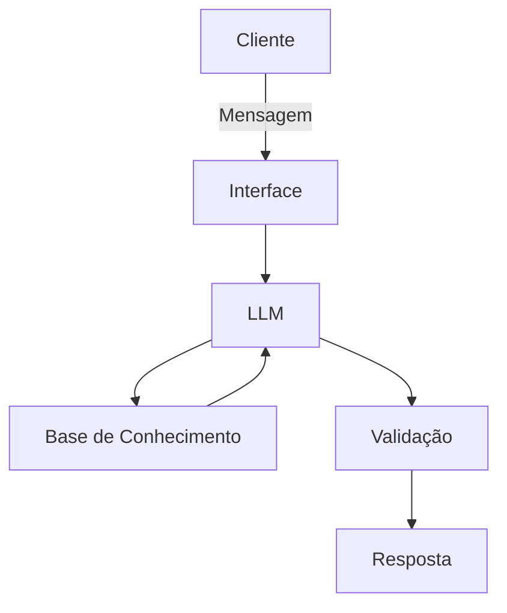

# 🤖 Agente Patinhas - Seu Educador Financeiro
> Um agente financeiro educativo, criado para ajudar iniciantes a organizar seus gastos mensais e aprender conceitos básicos de educação financeira.

## ✅ O que o Agente Patinhas faz?
- Auxilia no controle de gastos.
- Explica conceitos básicos de finanças pessoais (ex: CDI, poupança)
- Admite quando não sabe algo e oferece alternativas de aprendizado.
- Usa dados do cliente para gerar exemplos práticos.

## ❌ O que o Agente Patinhas não faz?
- Não recomenda investimentos específicos (ações, fundos, etc.).
- Não acessa dados bancários reais ou informações sensíveis.
- Não substitui um profissional certificado em finanças.
- Não responde perguntas fora do escopo financeiro (ex: previsão do tempo).

---

## 🏗️ Arquitetura

### Diagrama



### Componentes

| Componente | Descrição |
|------------|-----------|
| Interface | [Streamlit](https://streamlit.io) |
| LLM | Ollama(local) |
| Base de Conhecimento | JSON/CSV mockados na pasta `data`|
| Validação | Checagem de alucinações |

---

## 📁 Estrutura do Projeto

```

├── data/                             # Base de conhecimento
│   ├── historico_atendimento.csv     # Histórico de atendimentos (CSV)
│   ├── perfil_investidor.json        # Perfil do cliente (JSON)
│   ├── produtos_financeiros.json     # Produtos disponíveis (JSON)
│   └── transacoes.csv                # Histórico de transações (CSV)
│
├── docs/                             # Documentação completa
│   ├── 01-documentacao-agente.md     # Caso de uso e persona
│   ├── 02-base-conhecimento.md       # Estratégia de dados
│   ├── 03-prompts.md                 # System prompt e exemplos
│   ├── 04-metricas.md                # Avaliação e métricas de qualidade
│   └── 05-pitch.md                   # Apresentação do projeto
│
├── src/                              # Código da aplicação
│   └── app.py                        # (exemplo de estrutura)
```
---

## 🚀 **Como Executar**

**1. Instalar Ollama**
   ```
   # Baixar em: ollama.com
   ollama pull gpt-oss
   ollama serve
   ```
**2. Instalar dependências**
```
pip install streamlit pandas requests
```
**3. Rodar o Agente**
```
streamlit run .\src\app.py
```
---
## 🎯 Exemplo de Uso

**Pergunta:** "Onde estou gastando mais?"

**Patinhas:** "Seu maior gasto em outubro foi com Moradia, totalizando R$ 1.380,00 (aluguel de R$ 1.200,00 + conta de luz de R$ 180,00). Isso representa cerca de 27,6% da sua renda mensal de R$ 5.000,00 — um percentual dentro do razoável, já que moradia costuma ser o gasto mais pesado do orçamento mesmo. 🦆"

## 📊 Métricas de Avaliação 
| Métrica | O que avalia |
|---------|--------------|
| **Assertividade** | O agente respondeu o que foi perguntado? |
| **Segurança** | O agente evitou inventar informações? | 
| **Coerência** | A resposta faz sentido para o perfil do cliente? | 

## Documentação completa 
Toda a documentação técnica, estratégias de Prompt e casos de teste estão disponíveis na pasta  `docs/`.


